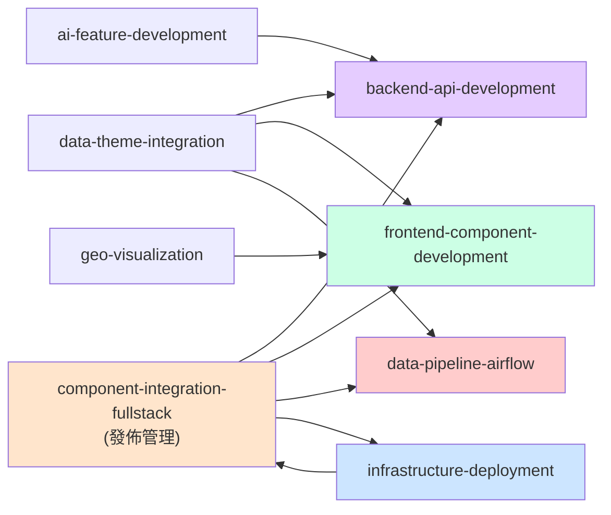

# Taipei City Dashboard - Agent Skills 完整指南

> 針對 Taipei City Dashboard 專案設計的 9 個高專精 agent skill，涵蓋全棧開發、資料工程、基礎設施、AI 特性與發佈管理，以及 Copilot 技能治理。

---

## 🛡️ Skill 治理更新（2026-04-15）

為避免 Skill 被過度觸發並增加上下文負擔，已將過寬 `applyTo: "**"` 收斂為明確路徑範圍。

| Skill | 調整前 | 調整後 |
|------|--------|--------|
| `component-integration-fullstack` | `**` | `Taipei-City-Dashboard-BE/**,Taipei-City-Dashboard-FE/**,Taipei-City-Dashboard-DE/**,docker/**,helm-chart/**,user-added/2026-this-year/docs/**` |
| `data-theme-integration` | `**` | `Taipei-City-Dashboard-DE/**,Taipei-City-Dashboard-BE/**,Taipei-City-Dashboard-FE/**,user-added/2026-this-year/docs/**` |

治理原則：
1. `applyTo` 必須對準真實工作檔案，避免全域匹配。
2. Skill 變更後同步更新本文件，確保團隊可追溯。
3. 新增 Skill 優先先定義範圍，再撰寫流程內容。

### 治理檢核表（每次修改 Skill 後執行）

- [ ] Frontmatter 具備 `name`、`description`、`applyTo`
- [ ] `description` 含 `Use when:` 且具體可觸發
- [ ] `applyTo` 未使用過寬全域範圍（避免 `**`）
- [ ] `.github/skills/README.md` 已同步入口或治理變更
- [ ] Skill 內部連結可點擊且路徑存在
- [ ] 未修改非需求範圍官方檔案（如 workflows、根 README）

### 稽核命令（快速巡檢）

若本機有 `rg`：

```powershell
rg -n "^name:|^description:|^applyTo:" .github/skills/**/SKILL.md
```

若本機沒有 `rg`（PowerShell 備援）：

```powershell
Get-ChildItem .github/skills -Recurse -Filter SKILL.md |
   Select-String -Pattern '^(name:|description:|applyTo:)' |
   ForEach-Object { "{0}:{1} {2}" -f $_.Path, $_.LineNumber, $_.Line.Trim() }
```

檢查過寬範圍（確認無 `applyTo: "**"`）：

```powershell
Get-ChildItem .github/skills -Recurse -Filter SKILL.md |
   Select-String -Pattern '^applyTo:\s*"\*\*"'
```

---

## 🎯 Skill 導航與優先級

| # | Skill 名稱 | 領域 | 適用場景 | 優先級 | 快速啟動 |
|----|-----------|------|---------|--------|---------|
| 1️⃣ | **backend-api-development** | 後端 | Go API、Controllers、Model 開發 | P0 | `/backend-api` |
| 2️⃣ | **frontend-component-development** | 前端 | Vue 3 組件、歷史圖表、地圖UI | P0 | `/frontend-component` |
| 3️⃣ | **data-pipeline-airflow** | 資料工程 | Airflow DAG、ETL、資料轉換 | P0 | `/data-pipeline` |
| 4️⃣ | **geo-visualization** | 地理空間 | 地圖、Deck.gl、GeoJSON、位置資料 | P1 | `/geo-viz` |
| 5️⃣ | **data-theme-integration** | 領域擴充 | 新資料主題端對端整合（黑客松型） | P1 | `/data-theme` |
| 6️⃣ | **ai-feature-development** | AI/LLM | LangChain、向量搜尋、聊天機器人 | P1 | `/ai-feature` |
| 7️⃣ | **infrastructure-deployment** | 基礎設施 | Docker、Kubernetes、Helm、監控 | P1 | `/infra-deploy` |
| 8️⃣ | **component-integration-fullstack** | 發佈管理 | 端對端組件發佈、整合測試、監控 | P0 | `/fullstack` |
| 9️⃣ | **agent-skill-authoring** | Copilot 治理 | 新增/修改 Skill、Instruction、Agent 設定 | P0 | `/agent-skill` |

---

## 📋 Skill 選用決策樹

### 我在做什麼？

```
我要寫 Go 代碼?
├─ YES → backend-api-development
│         ├─ 新 Controller/Model
│         ├─ API 設計與實現
│         ├─ 資料庫查詢最佳化
│         └─ 快取與認證
└─ NO → 繼續

我要寫 Vue/前端代碼?
├─ YES → frontend-component-development
│         ├─ 新組件開發
│         ├─ 狀態管理 (Pinia)
│         ├─ 圖表與互動
│         └─ 響應式設計
└─ NO → 繼續

我要寫資料轉換腳本/DAG?
├─ YES → data-pipeline-airflow
│         ├─ Airflow DAG 設計
│         ├─ Python/SQL 轉換
│         ├─ ETL 最佳實踐
│         └─ 品質檢查
└─ NO → 繼續

我在做位置/地圖功能?
├─ YES → geo-visualization
│         ├─ GeoJSON 轉換
│         ├─ Mapbox + Deck.gl
│         ├─ 座標系統
│         └─ 性能優化
└─ NO → 繼續

我要新增一個完整資料主題（如：新住民、垃圾清運）?
├─ YES → data-theme-integration
│         ├─ 需求評估
│         ├─ DE → BE → FE 全流程
│         ├─ 資料驗收
│         └─ 成本/優先級分析
└─ NO → 繼續

我在做 AI/ChatBot/向量搜尋?
├─ YES → ai-feature-development
│         ├─ LangChain 集成
│         ├─ Qdrant 配置
│         ├─ 提示詞工程
│         └─ 推理最佳化
└─ NO → 繼續

我在部署或配置 Docker/K8s?
├─ YES → infrastructure-deployment
│         ├─ Dockerfile 最佳化
│         ├─ Helm Chart 設置
│         ├─ 監控告警
│         └─ 災難恢復
└─ NO → 繼續

我在發佈新功能（跨層協調）?
├─ YES → component-integration-fullstack
│         ├─ 設計評審
│         ├─ 平行開發協調
│         ├─ 集成測試
│         ├─ 金絲雀部署
│         └─ 監控與反饋
└─ 無相符 Skill，使用標准 Agent

我要新增/修改 Copilot 的 Skill、Instruction、Agent 設定?
├─ YES → agent-skill-authoring
│         ├─ 判斷 Skill vs Instruction vs Agent
│         ├─ 撰寫正確 frontmatter
│         ├─ 控制 applyTo 範圍
│         └─ 同步技能入口與人讀文檔
└─ NO → 依上方領域技能選用
```

---

## 🏗️ 典型工作流程中的 Skill 使用

### 場景 1: "新增 AED 定位功能"
```
Phase 1: 需求
└─ component-integration-fullstack (設計評審階段)

Phase 2: 資料工程
├─ data-pipeline-airflow
│  └─ 新增 AED 資料 DAG

Phase 2b: 新資料主題集成
└─ data-theme-integration
   └─ 端對端評估與規劃

Phase 3: 後端
├─ backend-api-development
│  └─ GET /api/v1/aed, /api/v1/aed/stats

Phase 4: 前端
├─ frontend-component-development
│  └─ AED 列表組件
├─ geo-visualization
│  └─ 地圖層、標記、熱力圖

Phase 5: 發佈
├─ infrastructure-deployment (部署)
└─ component-integration-fullstack (整合測試、金絲雀發佈)
```

### 場景 2: "實現市民 AI 助手"
```
Phase 1: 架構設計
└─ component-integration-fullstack

Phase 2: AI 核心功能
└─ ai-feature-development
   ├─ LangChain + GPT-4o 集成
   ├─ 向量知識庫 (Qdrant)
   └─ 提示詞優化

Phase 3: 後端 API
├─ backend-api-development
│  └─ POST /api/v1/chat

Phase 4: 前端聊天 UI
├─ frontend-component-development
│  └─ ChatWindow 組件

Phase 5: 基礎設施 & 監控
└─ infrastructure-deployment
   ├─ GPU 資源分配
   └─ 推理負載監控

Phase 6: 發佈與監控
└─ component-integration-fullstack
   └─ 成本追蹤、使用者反饋
```

### 場景 3: "完整資料主題發佈（黑客松工作坊）"
```
Phase 1: 主題評估
└─ data-theme-integration
   ├─ 需求、資料源、成本
   └─ 優先級排序

Phase 2-4: 全棧開發
├─ data-pipeline-airflow (資料端)
├─ backend-api-development
├─ frontend-component-development
├─ geo-visualization (或其他)
└─ 可用 data-theme-integration 追蹤進度

Phase 5: 部署
└─ infrastructure-deployment

Phase 6: 發佈
└─ component-integration-fullstack
   ├─ 整合測試
   ├─ UAT
   └─ 監控儀表板建立
```

---

## 📊 Skill 特色與成熟度

### ✅ 全面覆蓋
- **後端 API**: GORM、快取、認證、錯誤處理
- **前端 UI**: Vue 3 Composition API、Pinia、圖表、無障礙
- **資料工程**: Airflow、ETL、品質檢查、監控
- **AI/LLM**: LangChain、向量搜尋、提示詞工程、成本控制
- **地理空間**: GeoJSON、Mapbox、Deck.gl、座標轉換
- **基礎設施**: Docker、K8s、Helm、監控、備份
- **整合管理**: 設計→開發→測試→發佈→監控

### ⚡ PM 導向結構
每個 Skill 都包含：
- **目標與里程碑** (含 KPI)
- **優先級 (P0/P1/P2)**
- **工作流程** (Phase 分解)
- **決策樹** (技術選型)
- **檢查清單** (驗收標準)

### 🎯 針對專案特色
- **支援 100+ 資料主題**: AED、長照、教育、環保、經濟
- **微服務架構**: 無狀態 API、快取首選
- **地理空間優先**: 地圖、位置查詢、GeoJSON
- **AI 就緒**: Qdrant 向量 DB、ONNX 支援
- **容器原生**: Docker Compose → Helm 升級路徑

---

## 🚀 快速開始

### 0️⃣ 部署環境（首先做這個）

按 **F5** 一鍵快速部署所有容器：
```powershell
# VS Code 中
F5 → "F5: Docker Quick Deploy"
# 或
F5 → "F5: Docker Full Bootstrap" (首次完整初始化)
```

✅ **自動完成**：
- .env 檔案檢查與生成
- Docker 網路建立
- DB 初始化（首次）
- 前後端與資料庫啟動

📖 詳見：[DOCKER_QUICK_START.md](../../DOCKER_QUICK_START.md)

### 1️⃣ 首次選擇 Skill
1. **閱讀此指南** → 理解 Skill 全景
2. **查看決策樹** → 根據工作選擇 Skill
3. **開啟 Skill 文件** → `.github/skills/<name>/SKILL.md`
4. **依照工作流程** → Phase by Phase 執行

### 2️⃣ 在 VS Code Copilot 中啟用
```
# 在聊天框輸入 /
# 搜尋對應的 Skill 名稱
# 或使用快速啟動代碼（見導航表）

例:
/backend-api
/frontend-component
/data-pipeline
/infra-deploy  ← 部署與基礎設施 (新！)
```

---

## 📖 Skill 金鑰決策表

### 後端時的決策
| 問題 | 決策 |
|------|------|
| 快取策略? | 見 backend-api-development → 快取決策點 |
| JWT vs Session? | 見 backend-api-development → 認證決策點 |
| 資料庫索引? | 見 backend-api-development → GORM 優化小節 |

### 前端時的決策
| 問題 | 決策 |
|------|------|
| 用什麼圖表庫? | 見 frontend-component-development → 圖表選擇矩陣 |
| 狀態管理位置? | 見 frontend-component-development → 狀態管理模式 |
| 圖表選擇? | 見 geo-visualization → Deck.gl vs Mapbox |

### 資料工程時的決策
| 問題 | 決策 |
|------|------|
| 排程表達式? | 見 data-pipeline-airflow → 排程表達式常用表 |
| 品質檢查? | 見 data-pipeline-airflow → 資料品質檢查表 |
| 並行化? | 見 data-pipeline-airflow → 資源配置小節 |

---

## 🔄 Skill 相互依賴



**圖例**:
- 發佈管理 (A) 協調其他所有功能層
- 開發層 (B, C, D) 並行進行
- 方案特定層 (E, F, G) 按需選用
- 基礎設施 (H) 支撐全棧

---

## ✍️ Skill 維護與回饋

### 如何貢獻改進？
1. 開啟對應 Skill 文件 `.github/skills/<name>/SKILL.md`
2. 在 **分支** (feature/skill-improvements) 進行編輯
3. 新增或改進：
   - 工作流程階段
   - 決策樹與表格
   - 檢查清單項目
   - 代碼範例
4. 提交 PR 時，附上案例或改進說明

### 回饋渠道
- **問題與建議**: GitHub Issues (tag: `skill-enhancement`)
- **新 Skill 請求**: GitHub Discussions (category: `Skills`)

---

## 📚 相關文檔與資源

### 官方文檔
- [專案 README](../README.md)
- [貢獻指南](../CONTRIBUTING.md)
- [API 文檔](https://citydashboard.taipei/documentation/)

### 技術棧官方文檔
- **後端**: [Gin Framework](https://gin-gonic.com/), [GORM](https://gorm.io/)
- **前端**: [Vue 3](https://vuejs.org/), [Pinia](https://pinia.vuejs.org/), [Tailwind](https://tailwindcss.com/)
- **資料**: [Apache Airflow](https://airflow.apache.org/), [Pandas](https://pandas.pydata.org/)
- **地圖**: [Mapbox GL JS](https://docs.mapbox.com/), [Deck.gl](https://deck.gl/)
- **AI**: [LangChain](https://python.langchain.com/), [Qdrant](https://qdrant.tech/)
- **基礎設施**: [Docker](https://docs.docker.com/), [Helm](https://helm.sh/), [Kubernetes](https://kubernetes.io/docs/)

### 分析文檔
- [2026 Hackathon 項目分析](../analysis/2026-04-14_hackathon_update_analysis.md)

---

## 🎓 學習路徑建議

### 新手 (Day 1-2)
1. **閱讀**: 此指南 + 專案 README
2. **環境**: `docker compose up` 本地啟動
3. **選擇**: 1 個簡單 Skill (e.g., frontend-component)
4. **練習**: 跟著工作流程完成小功能

### 進階 (Week 1-2)
1. **多層協調**: component-integration-fullstack
2. **技術深度**: 2-3 個相關 Skill (e.g., backend + data)
3. **完整功能**: 從設計到發佈

### 專家 (Month 1+)
1. **架構優化**: infrastructure-deployment + multicloud
2. **新領域擴充**: data-theme-integration + 黑客松主題
3. **AI 整合**: ai-feature-development

---

## ❓ 常見問題

**Q: 我只想做前端，需要全部 Skill 嗎？**  
A: 否。參考 Skill 導航表，僅需 `frontend-component-development`。若涉及地圖，加上 `geo-visualization`。

**Q: 如何處理 Skill 中沒有涵蓋的場景？**  
A: 使用 [Skill 維護](#-skill-維護與回饋) 的回饋渠道提出，或建議新 Skill。

**Q: Skill 與 Instructions 的差異？**  
A: Skill = 多步驟工作流 + 資產 (碼片、範本)；Instructions = 單層指導 (always-on)。Skill 更細緻、可重用。

**Q: 可以離線使用 Skill 嗎？**  
A: 可以！下載 `.github/skills/` 目錄到本地，Markdown 格式離線閱讀。

---

## 📞 支援與聯繫

- **專案主頁**: https://citydashboard.taipei
- **GitHub Issues**: [提報問題](https://github.com/tpe-doit/Taipei-City-Dashboard/issues)
- **文件**: https://citydashboard.taipei/documentation/
- **社群**: GitHub Discussions

---

**最後更新**: 2026-04-14  
**維護者**: Taipei Urban Intelligence Center (TUIC)  
**授權**: CC0 (開放使用與改進)
